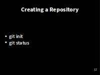

> ## Learning Objectives {.objectives}
> 
> *   Explain how to create a Git repository locally.

So, first let's change to our code directory.  Note that this is *not* the directory that you were using in the **Python** lesson, but should contain

~~~ {.bash}
$ cd ~/2015-12-15-Southampton/novice/git/code
$ ls
~~~

~~~ {.output}
climate_analysis.py  temp_conversion.py
~~~~

Once Git is configured,
we can start using it.

Now, lets tell Git to create a [repository](reference.html#repository)&mdash; A storage area where git records the full history of commits of a project and information about **who** changed **what** and **when**.

~~~ {.bash}
$ git init
~~~

If we use `ls` to show the directory's contents,
it appears that nothing has changed:

~~~ {.bash}
$ ls
~~~

But, if we add the `-a` flag to show everything,
we can see that Git has created a hidden directory called `.git`:

~~~ {.bash}
$ ls -a
~~~
~~~ {.output}
.	..	.git
~~~

Git stores information about the project in here.
If we ever delete it,
we will lose the project's history.

We can check that everything is set up correctly
by asking Git to tell us the status of our project with the **status** command:

~~~ {.bash}
$ git status
~~~
~~~ {.output}
# On branch master
#
# Initial commit
#
nothing to commit (create/copy files and use "git add" to track)
~~~
A **branch** is an independent line of development.  We have only one, and the default name is **master**.

[Next - Tracking Changes](03-changes.html)
