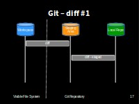
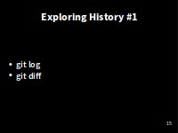
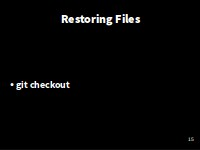

> ## Learning Objectives {.objectives}
> 
> *   Go through the modify-add-commit cycle for single and multiple files.
> *   Explain where information is stored at each stage.

###Create a file###

Let's create a file called `mars.txt` that contains some notes
about the Red Planet's suitability as a base.
(We'll use `nano` to edit the file;
you can use whatever editor you like.)

~~~ {.bash}
$ nano mars.txt
~~~

Under Windows, you'll need to choose to save it to under your home directory "C\:\\Users\\Me\\planets"

Type the text below into the `mars.txt` file:

~~~ {.output}
Cold and dry, but everything is my favorite color (You're Dracula - right?)
~~~

`mars.txt` now contains a single line:

~~~ {.bash}
$ ls
~~~
~~~ {.output}
mars.txt
~~~
~~~ {.bash}
$ cat mars.txt
~~~
~~~ {.output}
Cold and dry, but everything is my favorite color
~~~

###Check Status###
If we check the status of our project again,
Git tells us that it's noticed the new file:

~~~ {.bash}
$ git status
~~~
~~~ {.output}
# On branch master
#
# Initial commit
#
# Untracked files:
#   (use "git add <file>..." to include in what will be committed)
#
#	mars.txt
nothing added to commit but untracked files present (use "git add" to track)
~~~

The "untracked files" message means that there's a file in the directory
that Git isn't keeping track of.

###Add to Version Control###

We can tell Git to track a file using `git add`:

~~~ {.bash}
$ git add mars.txt
~~~

and then check that the right thing happened:

~~~ {.bash}
$ git status
~~~
~~~ {.output}
# On branch master
#
# Initial commit
#
# Changes to be committed:
#   (use "git rm --cached <file>..." to unstage)
#
#	new file:   mars.txt
#
~~~

Git now knows that it's supposed to keep track of `mars.txt`,
but it hasn't recorded these changes as a commit yet.

###Initial Commit###
To get it to do that,
we need to run one more command:

~~~ {.bash}
$ git commit -m "Start notes on Mars as a base"
~~~

We use the `-m` flag (for "**message**")
to record a short, descriptive, and specific comment that will help us remember later on what we did and why.
If we just run `git commit` without the `-m` option,
Git will launch `nano` (or whatever other editor we configured at the start)
so that we can write a longer message.

**Good commit messages** start with a brief (<50 characters) summary of
changes made in the commit.  

**NOT Bug Fixes** or **Changes**!

If you want to go into more detail, add
a blank line between the summary line and your additional notes.

~~~ {.output}
[master (root-commit) f22b25e] Start notes on Mars as a base
 1 file changed, 1 insertion(+)
 create mode 100644 mars.txt
~~~

When we run `git commit`,
Git takes everything we have told it to save by using `git add`
and stores a copy permanently inside the special `.git` directory.
This permanent copy is called a [revision](reference.html#revision)
and its short identifier is `f22b25e`.
(Your revision will have different identifier.)

If we run `git status` now:

~~~ {.bash}
$ git status
~~~
~~~ {.output}
# On branch master
nothing to commit, working directory clean
~~~
it tells us everything is up to date.

Git has a special **staging** area
where it keeps track of things that have been **added** to
the current [change set](reference.html#change-set)
but **not yet committed**.
`git add` puts things in this area,
and `git commit` then copies them to long-term storage (as a commit):

###Review the Log###
If we want to know what we've done recently,
we can ask Git to show us the project's history using `git log`:

~~~ {.bash}
$ git log
~~~
~~~ {.output}
commit f22b25e3233b4645dabd0d81e651fe074bd8e73b
Author: Vlad Dracula <vlad@tran.sylvan.ia>
Date:   Thu Aug 22 09:51:46 2013 -0400

    Start notes on Mars as a base
~~~

`git log` lists all revisions  made to a repository in reverse chronological order.

The listing for each revision includes
the revision's full identifier
(which starts with the same characters as
the short identifier printed by the `git commit` command earlier),
the revision's author,
when it was created,
and the log message Git was given when the revision was created.

> ## Where Are My Changes? {.callout}
>
> If we run `ls` at this point, we will still see just one file called `mars.txt`.
> That's because Git saves information about files' history
> in the special `.git` directory mentioned earlier
> so that our filesystem doesn't become cluttered
> (and so that we can't accidentally edit or delete an old version).

###Modify the file (1)###
Now suppose we add more information to the file:

~~~ {.bash}
$ nano mars.txt
$ cat mars.txt
~~~
~~~ {.output}
Cold and dry, but everything is my favorite color
The two moons may be a problem for Wolfman
~~~

When we run `git status` now,
it tells us that a file it already knows about has been modified:

~~~ {.bash}
$ git status
~~~
~~~ {.output}
# On branch master
# Changes not staged for commit:
#   (use "git add <file>..." to update what will be committed)
#   (use "git checkout -- <file>..." to discard changes in working directory)
#
#	modified:   mars.txt
#
no changes added to commit (use "git add" and/or "git commit -a")
~~~

The last line is the key phrase:
"no changes added to **commit**".

So, while we have changed this file,
but we haven't told Git we will want to save those changes
(which we do with `git add`)
much less actually saved them (which we do with `git commit`).

**It's important to remember that git only stores changes when you make a commit**

###Review Changes and Commit* ###
It is good practice to always review
our changes before saving them. We do this using `git diff`.
This shows us the differences between the current state
of the file and the most recently saved version:

~~~ {.bash}
$ git diff
~~~
~~~ {.output}
diff --git a/mars.txt b/mars.txt
index df0654a..315bf3a 100644
--- a/mars.txt
+++ b/mars.txt
@@ -1 +1,2 @@
 Cold and dry, but everything is my favorite color
+The two moons may be a problem for Wolfman
~~~

> ## Windows users note {.callout}
>
> **No newline at end of file**
> This message is displayed because otherwise there is no way to tell the difference between a file where there is a newline at the end and one where is not. Diff has to output a newline anyway, or the result would be harder to read or process automatically.
> This can safely be ignored, but you can avoid seeing it by leaving a blank line at the end of your file.

The output is cryptic because
it is actually a series of commands for tools like editors and `patch`
telling them how to reconstruct one file given the other.

The key things to note are:

 1. Line 1: The files that are being compared (a/ and b/ are labels, not paths)
 2. Line 2: The two hex strings on the second line which parts of the hashes of the files being compares
 3. Line 5: The lines that have changed. 
 4. Below that, the changes - note the '**+**' marker which shows an addtion

After reviewing our change, it's time to commit it:

~~~ {.bash}
$ git commit -m "Add concerns about effects of Mars's moons on Wolfman"
~~~
~~~ {.output}
# On branch master
# Changes not staged for commit:
#   (use "git add <file>..." to update what will be committed)
#   (use "git checkout -- <file>..." to discard changes in working directory)
#
#	modified:   mars.txt
#
no changes added to commit (use "git add" and/or "git commit -a")
~~~

**Whoops**:
Git won't commit because we didn't use `git add` first.
Let's fix that:

~~~ {.bash}
$ git add mars.txt
$ git commit -m "Add concerns about effects of Mars' moons on Wolfman"
~~~
~~~ {.output}
[master 34961b1] Add concerns about effects of Mars' moons on Wolfman
 1 file changed, 1 insertion(+)
~~~

** Recapping add / commit**

Git insists that we **add** files to the set we want to commit
before actually committing anything
because we may not want to commit everything at once.

For example,
suppose we're adding a few citations to our supervisor's work
to our thesis.
We might want to commit those additions,
and the corresponding addition to the bibliography,
but *not* commit the work we're doing on the conclusion
(which we haven't finished yet).

###One more addition###

Let's add another line to the file:

~~~ {.bash}
$ nano mars.txt
$ cat mars.txt
~~~
~~~ {.output}
Cold and dry, but everything is my favorite color
The two moons may be a problem for Wolfman
But the Mummy will appreciate the lack of humidity
~~~
Check what's changed with **diff**:

~~~ {.bash}
$ git diff
~~~
~~~ {.output}
diff --git a/mars.txt b/mars.txt
index 315bf3a..b36abfd 100644
--- a/mars.txt
+++ b/mars.txt
@@ -1,2 +1,3 @@
 Cold and dry, but everything is my favorite color
 The two moons may be a problem for Wolfman
+But the Mummy will appreciate the lack of humidity
~~~

So far, so good:
we've added one line to the end of the file
(shown with a `+` in the first column).

Now let's put that change in the staging area (or **add it to the change set**)
and see what `git diff` reports:

~~~ {.bash}
$ git add mars.txt
$ git diff
~~~

~~~ {.output}
~~~

**There is no output**:

**git diff** shows us the differences between the *working copy* and what's been added to the **change set** in staging area.

However, if we do this:

~~~ {.bash}
$ git diff --staged
~~~
~~~ {.output}
diff --git a/mars.txt b/mars.txt
index 315bf3a..b36abfd 100644
--- a/mars.txt
+++ b/mars.txt
@@ -1,2 +1,3 @@
 Cold and dry, but everything is my favorite color
 The two moons may be a problem for Wolfman
+But the Mummy will appreciate the lack of humidity
~~~

it shows us the difference between
the last **committed change**
and what's in the **staging area**.

Let's **commit** our changes:

~~~ {.bash}
$ git commit -m "Discuss concerns about Mars's climate for Mummy"
~~~
~~~ {.output}
[master 005937f] Discuss concerns about Mars's climate for Mummy
 1 file changed, 1 insertion(+)
~~~

check our status:

~~~ {.bash}
$ git status
~~~
~~~ {.output}
# On branch master
nothing to commit, working directory clean
~~~

and now look at the history of what we've done so far:

~~~ {.bash}
$ git log
~~~
~~~ {.output}
commit 005937fbe2a98fb83f0ade869025dc2636b4dad5
Author: Vlad Dracula <vlad@tran.sylvan.ia>
Date:   Thu Aug 22 10:14:07 2013 -0400

    Discuss concerns about Mars' climate for Mummy

commit 34961b159c27df3b475cfe4415d94a6d1fcd064d
Author: Vlad Dracula <vlad@tran.sylvan.ia>
Date:   Thu Aug 22 10:07:21 2013 -0400

    Add concerns about effects of Mars' moons on Wolfman

commit f22b25e3233b4645dabd0d81e651fe074bd8e73b
Author: Vlad Dracula <vlad@tran.sylvan.ia>
Date:   Thu Aug 22 09:51:46 2013 -0400

    Start notes on Mars as a base
~~~

To recap, when we want to add changes to our repository,
we first need to add the changed files to the staging area
(`git add`) and then commit the staged changes to the
repository (`git commit`):

[Next - Exploring History](04-history.html)
