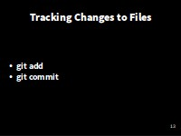
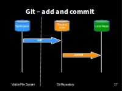

> ## Learning Objectives {.objectives}
> 
> *   Go through the modify-add-commit cycle for single and multiple files.
> *   Explain where information is stored at each stage.

###Add to Version Control###

We can tell Git to track a file using `git add`:

~~~ {.bash}
$ git add climate_analysis.py temp_conversion.py
~~~

and then check that the right thing happened:

~~~ {.bash}
$ git status
~~~
~~~ {.output}
On branch master

Initial commit

Changes to be committed:
  (use "git rm --cached <file>..." to unstage)

        new file:   climate_analysis.py
        new file:   temp_conversion.py
~~~

Git now knows that it's supposed to keep track of `climate_analysis.py` and `temp_conversion.py`,
but it hasn't recorded these changes as a commit yet.

###Initial Commit###
To get it to do that,
we need to run one more command:

~~~ {.bash}
$ git commit -m "Initial commit of climate analysis code"
~~~

We use the `-m` flag (for "**message**")
to record a short, descriptive, and specific comment that will help us remember later on what we did and why.
If we just run `git commit` without the `-m` option,
Git will launch `nano` (or whatever other editor we configured at the start)
so that we can write a longer message.

**Good commit messages** start with a brief (<50 characters) summary of
changes made in the commit.  

**NOT "Bug Fixes"** or **"Changes"**!

If you want to go into more detail, add
a blank line between the summary line and your additional notes.

~~~ {.output}
[master (root-commit) a10bd8f] Initial commit of climate analysis code
 2 files changed, 50 insertions(+)
 create mode 100644 climate_analysis.py
 create mode 100644 temp_conversion.py
~~~

When we run `git commit`,
Git takes everything we have told it to save by using `git add`
and stores a copy permanently inside the special `.git` directory.
This permanent copy is called a [revision](reference.html#revision)
and its short identifier is `a10bd8f`.
(Your revision will have different identifier.)

If we run `git status` now:

~~~ {.bash}
$ git status
~~~
~~~ {.output}
# On branch master
nothing to commit, working directory clean
~~~
it tells us everything is up to date.

Git has a special **staging** area
where it keeps track of things that have been **added** to
the current [change set](reference.html#change-set)
but **not yet committed**.
`git add` puts things in this area,
and `git commit` then copies them to long-term storage (as a commit)

###Review the Log###
If we want to know what we've done recently,
we can ask Git to show us the project's history using `git log`:

~~~ {.bash}
$ git log
~~~
~~~ {.output}
commit a10bd8f6192f9ab29b1821d7d7929fbf6484686a
Author: John R <j.robinson@software.ac.uk>
Date:   Mon Dec 7 14:13:32 2015 +0000

    Initial commit of climate analysis code
~~~

`git log` lists all revisions  made to a repository in reverse chronological order.

The listing for each revision includes
the revision's full identifier
(which starts with the same characters as
the short identifier printed by the `git commit` command earlier),
the revision's author,
when it was created,
and the log message Git was given when the revision was created.

> ## Where Are My Changes? {.callout}
>
> If we run `ls` at this point, we will still see just our original files called `climate_analysis.py` and `temp_conversion.py`.
> That's because Git saves information about files' history
> in the special `.git` directory mentioned earlier
> so that our filesystem doesn't become cluttered
> (and so that we can't accidentally edit or delete an old version).

###Modify a file (1)###
Now suppose we add more information, a **Docstring**, to the **top** of one of the files:

~~~ {.bash}
$ nano climate_analysis.py
~~~
~~~ {.output}
""" Climate Analysis Tools """
~~~

When we run `git status` now,
it tells us that a file it already knows about has been modified:

~~~ {.bash}
$ git status
~~~
~~~ {.output}
On branch master
Changes not staged for commit:
  (use "git add <file>..." to update what will be committed)
  (use "git checkout -- <file>..." to discard changes in working directory)

		modified:   climate_analysis.py

no changes added to commit (use "git add" and/or "git commit -a")
~~~

The last line is the key phrase:
"no changes added to **commit**".

So, while we have changed this file,
but we haven't told Git we will want to save those changes
(which we do with `git add`)
much less actually saved them (which we do with `git commit`).

**It's important to remember that git only stores changes when you make a commit**

###Review Changes and Commit###
It is good practice to always review
our changes before saving them. We do this using `git diff`.
This shows us the differences between the current state
of the file and the most recently saved version:

~~~ {.bash}
$ git diff
~~~
~~~ {.output}
diff --git a/climate_analysis.py b/climate_analysis.py
index 277d6c7..d5b442d 100644
--- a/climate_analysis.py
+++ b/climate_analysis.py
@@ -1,3 +1,4 @@
+""" Climate Analysis Tools """
import sys
import temp_conversion
import signal
~~~

> ## Windows users note {.callout}
>
> **No newline at end of file**
> This message is displayed because otherwise there is no way to tell the difference between a file where there is a newline at the end and one where is not. Diff has to output a newline anyway, or the result would be harder to read or process automatically.
> This can safely be ignored, but you can avoid seeing it by leaving a blank line at the end of your file.

The output is cryptic because
it is actually a series of commands for tools like editors and `patch`
telling them how to reconstruct one file given the other.

The key things to note are:

 1. Line 1: The files that are being compared (a/ and b/ are labels, not paths)
 2. Line 2: The two hex strings on the second line which parts of the hashes of the files being compares
 3. Line 5: The lines that have changed. 
 4. Below that, the changes - note the '**+**' marker which shows an addtion

After reviewing our change, it's time to commit it:

~~~ {.bash}
$ git commit -m "Add Docstring"
~~~
~~~ {.output}
On branch master
Changes not staged for commit:
        modified:   climate_analysis.py

no changes added to commit
~~~

**Whoops**:
Git won't commit because we didn't use `git add` first.
Let's fix that:

~~~ {.bash}
$ git add climate_analysis.py
$ git commit -m "Add Docstring"
~~~
~~~ {.output}
[master 6077ba7] Add Docstring
 1 file changed, 1 insertion(+)
~~~

** Recapping add / commit**

Git insists that we **add** files to the set we want to commit
before actually committing anything
because we may not want to commit everything at once.

For example,
suppose we're adding a few citations to our supervisor's work
to our thesis.
We might want to commit those additions,
and the corresponding addition to the bibliography,
but *not* commit the work we're doing on the conclusion
(which we haven't finished yet).

###One more addition###

Let's add another line to the end of the file:

~~~ {.bash}
$ nano climate_analysis.py
~~~
~~~ {.output}
# TODO(js-robinson): Add call to process rainfall
~~~
Check what's changed with **diff**:

~~~ {.bash}
$ git diff
~~~
~~~ {.output}
diff --git a/climate_analysis.py b/climate_analysis.py
index d5b442d..c463f71 100644
--- a/climate_analysis.py
+++ b/climate_analysis.py
@@ -26,3 +26,5 @@ for line in climate_data:
             kelvin = temp_conversion.fahr_to_kelvin(fahr)
 
             print(str(celsius)+", "+str(kelvin))
+
+# TODO(js-robinson): Add call to process rainfall
~~~

So far, so good:
we've added one line to the end of the file
(shown with a `+` in the first column).

Now let's put that change in the staging area (or **add it to the change set**)
and see what `git diff` reports:

~~~ {.bash}
$ git add climate_analysis.py
$ git diff
~~~

~~~ {.output}
~~~

**There is no output**:

**git diff** shows us the differences between the *working copy* and what's been added to the **change set** in staging area.

However, if we do this:

~~~ {.bash}
$ git diff --staged
~~~
~~~ {.output}
diff --git a/climate_analysis.py b/climate_analysis.py
index d5b442d..c463f71 100644
--- a/climate_analysis.py
+++ b/climate_analysis.py
@@ -26,3 +26,5 @@ for line in climate_data:
             kelvin = temp_conversion.fahr_to_kelvin(fahr)
 
             print(str(celsius)+", "+str(kelvin))
+
+# TODO(me): Add call to process rainfall
~~~

it shows us the difference between
the last **committed change**
and what's in the **staging area**.

Let's **commit** our changes:

~~~ {.bash}
$ git commit -m "Add rainfall processing placeholder"
~~~
~~~ {.output}
[master dab17a9] Add rainfall processing placeholder
 1 file changed, 2 insertions(+)
~~~

check our status:

~~~ {.bash}
$ git status
~~~
~~~ {.output}
# On branch master
nothing to commit, working directory clean
~~~

and now look at the history of what we've done so far:

~~~ {.bash}
$ git log
~~~
~~~ {.output}
commit dab17a9f0d2e8e598522a1c06dcaf396084f60e6
Author: John R <j.robinson@software.ac.uk>
Date:   Mon Dec 7 14:57:39 2015 +0000

    Add rainfall processing placeholder

commit 6077ba7b614de65fa28cc58c6cb8a4c55735a9d8
Author: John R <j.robinson@software.ac.uk>
Date:   Mon Dec 7 14:40:02 2015 +0000

    Add Docstring

commit a10bd8f6192f9ab29b1821d7d7929fbf6484686a
Author: John R <j.robinson@software.ac.uk>
Date:   Mon Dec 7 14:13:32 2015 +0000

    Initial commit of climate analysis code

~~~

To recap, when we want to add changes to our repository,
we first need to add the changed files to the staging area
(`git add`) and then commit the staged changes to the
repository (`git commit`):

[Next - Exploring History](04-history.html)
