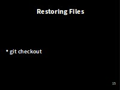
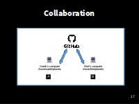
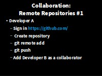
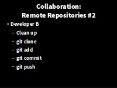
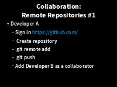

> ## Learning Objectives {.objectives}
>
> *   Explain what remote repositories are and why they are useful.
> *   Explain what happens when a remote repository is cloned.
> *   Explain what happens when changes are pushed to or pulled from a remote repository.

So far, we've seen how Version control can help us **track the changes** we make to our files, and to **revisit** any point in their history.

(there are a few extra commands we haven't covered today for you to look at).

But, version control really comes into its own
when we begin to **collaborate** with other people.

###The missing link###
We already have most of the machinery we need to do this;
the only thing missing is to copy changes from one repository to another.

Systems like Git allow us to **synchronise** work between any two repositories.

In practice,
though, it's easiest to use one copy as a **central hub**,
and to keep it on the web rather than on someone's laptop.

Many programmers use hosting services like **GitHub** or **BitBucket**
to hold those master copies;  we'll explore the pros and cons of these a bit later.  

###Exploring the collaborative process###

But first let's explore the collaborative process.  Time to buddy up.

So far we have been working in splendid isolation.  We're going to use **GitHub** to set up a remote repository and start **"collaborating"** with our partners.

**Developer A** is going to take the role of the project originator. 
**Developer B** is going to take now on the role of a colleague joining the project and collaborating in development. 

With the help of two terminals (opened in different directories on the same computer), **I'll be taking on both roles**.
In your pairs, **decide** who will be Developer A and Developer B while I get set up.

###Developer A - To GitHub! ###

Now, **Bs just sit back** for a moment and **watch A** until told otherwise

**JUST A's**. Let's start by sharing the changes we've made to our current project with the world.
**Log in to GitHub**,
then click on the icon in the top right corner to create a **new repository** called `climate-analysis`:

**Name your repository** "climate-analysis" 
You can optionally give it a friendly **description** and prove a **README.md** which is rendered on the front page of the web interface.

GitHub will host **Publicly** accessible repositories **free** of charge, but makes a charge for Private ones.  **BitBucket** offers free private repositories for teams of up to 5.  

You need to be sure that you really want to make your code publicly accessible, think about **licensing**, and that you're not breaching the terms of any license of shared code by making it publicly available.

and then click **"Create Repository"**:

###Connecting the remote repository###

Our **local** repository still contains our earlier work on `climate-analysis.py` and `temp_conversion.py`,
but the **remote** repository on GitHub doesn't contain any files yet:

The next step is to **connect** the two repositories.

We do this by making the GitHub repository a [remote](reference.html#remote)
for the local repository.  A **remote** is a repository conected to another in such way that both can be kept in sync exchanging commits.

The home page of the repository on GitHub includes
the string we need to identify it:

Copy that URL from the browser,
go into the local `planets` repository,
and run this command:

~~~ {.bash}
$ git remote add origin https://github.com/js-robinson/climate-analysis.git
~~~

The name `origin` is a **local nickname** for your **remote repository**:
we **could** use something else if we wanted to,
but `origin` is **conventional**, and will come in useful later.

Make sure to use the URL for your repository rather than Vlad's:
the only difference should be your username instead of `js-robinson`.
:
Where to Find Repository URL on GitHub
We can check that the command has worked by running `git remote -v`:

~~~ {.bash}
$ git remote -v
~~~
~~~ {.output}
origin  https://github.com/js-robinson/climate-analysis.git (fetch)
origin  https://github.com/js-robinson/climate-analysis.git (push)
~~~

###Push commits from local to remote###

Once the remote is set up, we can **push** the changes from our local repository
to the repository on GitHub:

~~~ {.bash}
$ git push origin master
~~~
~~~ {.output}
Counting objects: 10, done.
Delta compression using up to 8 threads.
Compressing objects: 100% (10/10), done.
Writing objects: 100% (10/10), 1.47 KiB | 0 bytes/s, done.
Total 10 (delta 2), reused 0 (delta 0)
To https://github.com/js-robinson/climate-analysis.git
 * [new branch]      master -> master
~~~
The push command takes two arguments, the **remote name** ('origin') and a **branch name** ('master').

We haven't yet discussed **branching** yet, and we won't have time to do so today.

**Branching** is a feature common
to almost all version control systems and gives you the ability to **diverge** from the main line of development
and to continue to do work without messing with that main line.  The main (default) branch is the **master**.

At a later time you can re-integrate branches to the master.

So, for **Developer A**, our local and remote repositories are now **in sync**!

###Testing Pull###

**Still as Dev. A**  We can **pull** changes from the remote repository to the local one as well:

~~~ {.bash}
$ git pull origin master
~~~
~~~ {.output}
From https://github.com/js-robinson/climate-analysis
 * branch            master     -> FETCH_HEAD
Already up-to-date.
~~~

Pulling has **no effect** in this case
because the two repositories are already **synchronized**.
If someone else had pushed some changes to the repository on GitHub, this command would download them to our local repository.

**Lastly**, let's **add Developer B** as a collaborator on our project.  Return to the repos GitHub page, and click the **Settings** link on the **right**, followed by the **collaborators** link on the **left**.  Add Developer B with there GitHub username.

###Developer B - Cloning the remote repository###

Now **Developer B gets a go**! -  **Developer A**, you can **take a break** and watch.

First, we need to move away from our own copies of the filse, to avoif confusion.  Remember, in this example, Developer B is playing the role of a fresh collaborator on the project 

~~~ {.bash}
$ cd
~~~ 

~~~ {.bash}
$ git clone https://github.com/js-robinson/climate-analysis.git
~~~
~~~ {.output}
Cloning into 'climate-analysis'...
remote: Counting objects: 10, done.
remote: Compressing objects: 100% (8/8), done.
remote: Total 10 (delta 2), reused 10 (delta 2), pack-reused 0
Unpacking objects: 100% (10/10), done.
Checking connectivity... done.
~~~
`git clone` creates a fresh local copy of a remote repository.

Let check what we've got:

~~~ {.bash}
$ cd climate-analysis
$ ls
~~~

~~~ {.output}
climate_analysis.py  temp_conversion.py
~~~

###Developer B - Add rainfall_conversion.py ###
Lets expand our library of climate analysis functions by adding a new module:

~~~ {.bash}
$ nano rainfall_conversion.py
$ cat rainfall_conversion.py
~~~

~~~ {.output}
"""A library to perform rainfall unit conversions"""

def inches_to_mm(inches):
    """Convert inches to milimetres.

    Arguments:
    inches -- the rainfall inches
    """
    mm = inches * 25.4
    return mm
~~~

~~~ {.bash}
$ git add rainfall_conversion.py
$ git commit -m "Add rainfall module"
~~~
~~~ {.output}
[master bcbf9be] Add rainfall module
 1 file changed, 11 insertions(+)
 create mode 100644 rainfall_conversion.py
~~~

then push the change to GitHub:

~~~ {.bash}
$ git push origin master
~~~
~~~ {.output}
Counting objects: 4, done.
Delta compression using up to 8 threads.
Compressing objects: 100% (3/3), done.
Writing objects: 100% (3/3), 475 bytes | 0 bytes/s, done.
Total 3 (delta 0), reused 0 (delta 0)                                                                                                 
To https://github.com/js-robinson/climate-analysis.git                                                                                
   dab17a9..bcbf9be  master -> master
~~~

Note that we **didn't** have to create a **remote** called `origin`:
Git does this automatically,
using that name,
when we clone a repository.
(This is why `origin` was a sensible choice earlier
when we were setting up remotes by hand.)

###Developer A - Pull in the changes###

Developer A can now update their repository with the changes made by B:

[** Check Working Directory**]

~~~ {.bash}
$ git pull origin master
~~~

~~~ {.output}
remote: Counting objects: 3, done.
remote: Compressing objects: 100% (3/3), done.
remote: Total 3 (delta 0), reused 3 (delta 0), pack-reused 0
Unpacking objects: 100% (3/3), done.
From https://github.com/js-robinson/climate-analysis
 * branch            master     -> FETCH_HEAD
   dab17a9..bcbf9be  master     -> origin/master
Updating dab17a9..bcbf9be
Fast-forward
 rainfall_conversion.py | 11 +++++++++++
 1 file changed, 11 insertions(+)
 create mode 100644 rainfall_conversion.py
~~~

**Hey look: We're collaborating!**

> ## Exercise: Two way collaboration {.challenge}
> Now lets work it the other way.
> Developer A can add a brief README.md stating the authors of the package we're developing (You), and describing its purpose "Tools to parse and convert climate data from CSV" 
> Add / commit them to their local repository and push them to github.
> Developer B can pull the updates

[Next - Conflicts](06-conflict.html)

