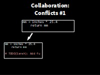
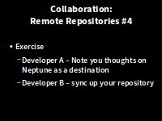

> ## Learning Objectives {.objectives}
>
> *   Explain what conflicts are and when they can occur.
> *   Resolve conflicts resulting from a merge.

As soon as people can work in **parallel**,
someone is going to step on someone else's toes.

This will even happen with a single person:
if we are working on a piece of software on both our laptop and a server in the lab,
we could make different changes to each copy.

These situations are called **conflicts**
Version control helps us manage these [conflicts](reference.html#conflicts)
by giving us tools to [resolve](reference.html#resolve) overlapping changes.

To see how we can resolve conflicts,
we must first create one.
The file `rainfall_conversion.py` currently looks like this
in both partners' copies of our `climate-analysis` repository:

~~~ {.bash}
$ cat rainfall_conversion.py
~~~
~~~ {.output}
"""A library to perform rainfall unit conversions"""

def inches_to_mm(inches):
    """Convert inches to milimetres.

    Arguments:
    inches -- the rainfall inches
    """
    mm = inches * 25.4
    return mm
~~~

###Developer A - Modify and Push###

Let's add a line to the bottom of Developer A's copy only:

~~~ {.bash}
$ nano rainfall_conversion.py
$ cat rainfall_conversion.py
~~~
~~~ {.output}
"""A library to perform rainfall unit conversions"""

def inches_to_mm(inches):
    """Convert inches to milimetres.

    Arguments:
    inches -- the rainfall inches
    """
    mm = inches * 25.4
    return mm

# TODO(Developer B): Add function to convert from inches to centimetres
~~~

and then push the change to GitHub:

~~~ {.bash}
$ git add rainfall_conversion.py
$ git commit -m "Developer A added a line"
~~~
~~~ {.output}
[master 5ae9631] Developer A added a line
 1 file changed, 1 insertion(+)
~~~
~~~ {.bash}
$ git push origin master
~~~
~~~ {.output}
Counting objects: 5, done.
Delta compression using up to 4 threads.
Compressing objects: 100% (3/3), done.
Writing objects: 100% (3/3), 352 bytes, done.
Total 3 (delta 1), reused 0 (delta 0)
To https://github.com/vlad/planets
   29aba7c..dabb4c8  master -> master
~~~

###Developer B - Modify and push without pull###

Now let's have Developer B make a different change to their copy
*without* updating (pulling) from GitHub:

~~~ {.bash}
$ nano rainfall_conversion.py
$ cat rainfall_conversion.py
~~~
~~~ {.output}
"""A library to perform rainfall unit conversions"""

def inches_to_mm(inches):
    """Convert inches to milimetres.

    Arguments:
    inches -- the rainfall inches
    """
    mm = inches * 25.4
    return mm

# TODO(Developer A): Add function to convert from inches to centimetres
~~~

We can commit the change locally:

~~~ {.bash}
$ git add rainfall_conversion.py
$ git commit -m "Developer B added a different line"
~~~
~~~ {.output}
[master 07ebc69] Developer B added a different line
 1 file changed, 1 insertion(+)
~~~

but Git won't let us push it to GitHub:

~~~ {.bash}
$ git push origin master
~~~
~~~ {.output}
To https://github.com/js-robinson/climate-analysis.git
 ! [rejected]        master -> master (non-fast-forward)
error: failed to push some refs to 'https://github.com/js-robinson/climate-analysis.git'
hint: Updates were rejected because the tip of your current branch is behind
hint: its remote counterpart. Merge the remote changes (e.g. 'git pull')
hint: before pushing again.
hint: See the 'Note about fast-forwards' in 'git push --help' for details.
~~~

Git **detects** that the **changes** made in one copy **overlap** with those made in the other
and **stops us from trampling** on our collaborators work.

What we have to do is **pull** the changes from GitHub,
[merge](reference.html#merge) them into the copy we're currently working in,
and **then push** that.

###Developer B - Pull and resolve###

Let's start by pulling:

~~~ {.bash}
$ git pull origin master
~~~
~~~ {.output}
remote: Counting objects: 5, done.        
remote: Compressing objects: 100% (2/2), done.        
remote: Total 3 (delta 1), reused 3 (delta 1)        
Unpacking objects: 100% (3/3), done.
From https://github.com/js-robinson/climate-analysis
 * branch            master     -> FETCH_HEAD
Auto-merging rainfall_conversion.py
CONFLICT (content): Merge conflict in rainfall_conversion.py
Automatic merge failed; fix conflicts and then commit the result.
~~~

`git pull` tells us there's a **conflict**,
and marks that conflict in the affected file:

~~~ {.bash}
$ cat rainfall_conversion.py
~~~
~~~ {.output}
"""A library to perform rainfall unit conversions"""

def inches_to_mm(inches):
    """Convert inches to milimetres.

    Arguments:
    inches -- the rainfall inches
    """
    mm = inches * 25.4
    return mm

<<<<<<< HEAD
# TODO(Developer A): Add function to convert from inches to centimetres
=======
# TODO(Developer B): Add function to convert from inches to centimetres
>>>>>>> dabb4c8c450e8475aee9b14b4383acc99f42af1d
~~~

Our change&mdash;the one in `HEAD`&mdash;is preceded by `<<<<<<<`.
Git has then inserted `=======` as a separator between the conflicting changes
and marked the end of the content downloaded from GitHub with `>>>>>>>`.
(The string of letters and digits after that marker
identifies the revision we've just downloaded.)

It is now **up to us** to **edit** this file to **remove these markers**
and **reconcile the changes**.

We can do anything we want: **keep the change made in the local repository**, **keep
the change made in the remote repository**, write something new to **replace both**,
or **get rid of the change** entirely.

Let's **replace** both so that the file looks like this:

~~~ {.bash}
$ cat rainfall_conversion.py
~~~
~~~ {.output}
"""A library to perform rainfall unit conversions"""

def inches_to_mm(inches):
    """Convert inches to milimetres.

    Arguments:
    inches -- the rainfall inches
    """
    mm = inches * 25.4
    return mm

# TODO(all): Hire a new developer
~~~
###Developer B - Add, Commit and Push###
To finish merging,
we add `rainfall_conversion.py` to the changes being made by the merge
and then commit:

~~~ {.bash}
$ git add rainfall_conversion.py
$ git status
~~~
~~~ {.output}
# On branch master
# All conflicts fixed but you are still merging.
#   (use "git commit" to conclude merge)
#
# Changes to be committed:
#
#	modified:   rainfall_conversion.py
#
~~~
~~~ {.bash}
$ git commit -m "Merging changes from GitHub"
~~~
~~~ {.output}
[master 2abf2b1] Merging changes from GitHub
~~~

Now we can push our changes to GitHub:

~~~ {.bash}
$ git push origin master
~~~
~~~ {.output}
Counting objects: 10, done.
Delta compression using up to 4 threads.
Compressing objects: 100% (6/6), done.
Writing objects: 100% (6/6), 697 bytes, done.
Total 6 (delta 2), reused 0 (delta 0)
To https://github.com/js-robinson/climate-analysis.git
   dabb4c8..2abf2b1  master -> master
~~~

Git keeps track of what we've merged with what,
so we don't have to fix things by hand again
when **Developer A** who made the first change pulls again:

### Developer A Pull###

~~~ {.bash}
$ git pull origin master
~~~
~~~ {.output}
remote: Counting objects: 10, done.        
remote: Compressing objects: 100% (4/4), done.        
remote: Total 6 (delta 2), reused 6 (delta 2)        
Unpacking objects: 100% (6/6), done.
From https://github.com/js-robinson/climate-analysis
 * branch            master     -> FETCH_HEAD
Updating dabb4c8..2abf2b1
Fast-forward
rainfall_conversion.py | 2 +-
 1 file changed, 1 insertion(+), 1 deletion(-)
~~~

we get the merged file:

~~~ {.bash}
$ cat rainfall_conversion.py
~~~
~~~ {.output}
"""A library to perform rainfall unit conversions"""

def inches_to_mm(inches):
    """Convert inches to milimetres.

    Arguments:
    inches -- the rainfall inches
    """
    mm = inches * 25.4
    return mm

# TODO(all): Hire a new developer
~~~

We have resolved the conflict

We don't need to merge again because Git knows someone has already done that.

Version control's ability to merge conflicting changes
is another reason users tend to divide their programs and papers into multiple files
instead of storing everything in one large file.
There's another benefit too:
whenever there are repeated conflicts in a particular file,
the version control system is essentially trying to tell its users
that they ought to clarify who's responsible for what,
or find a way to divide the work up differently.

> ## Reverse {.challenge}
> Now, Each add another line and Developer B push first.
> Developer A resolves the conflict
> Get yourselves back in sync

> ## Conflicts on Non-textual files {.challenge}
>
> What does Git do
> when there is a conflict in an image or some other non-textual file
> that is stored in version control?

###IF TIME###

[Ignoring Things](07-ignore.html)
