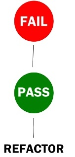

## So far...

- Have introduced the basic tools of programming
- But how do we know a program gives the right answer?

- We need to
    + write programs that check their own operation
    + write tests to catch the mistakes those self-checks miss

## Confess!

Why don't you write tests?

- "I don't write buggy code"
- "It's too hard"
- "It's not interesting"
- "It takes too much time and I've research to do"

## Ariane 5

- Ariane 5 used Ariane 4 code
- Ariane 5’s faster engines caused buffer overflow
- Buffer overflow caused Ariane 5 to explode!
- Unfortunately, code wasn't properly tested

Millions of pounds down the drain, some very red faces

## Consider Geoffrey Chang...

- Dept. of Molecular Biology, Scripps Institute
- 5th Annual Presidential Early Career Awards, 2000
- Beckerman Foundation Young Investigator Award, 2001 

Three pharma publications in *Science*, 2001-2005

Letters – Retraction, Science 22 December 2006

## And he's not alone...

- “A Test of Corrections for Extraneous Signals in Gridded Surface Temperature Data”, R. McKitrick et al, Climate Research, 2004
    + “McKitrick screws up yet again”, T. Lambert’s blog
    + “McKitrick mucks it up”, J. Quiggin’s blog
- “ERRATUM”, Climate Research, 2004
- “formula … takes the angle in *radians*, but our data were entered in *degrees*”

## He's *really* not alone...

- "Worms: Identifying Impacts on Education and Health in the Presence of Treatment Externalities", E. Miguel, M. Kremer, Econometrica, 2003
    + "Wrong answers typed into the program", Buzzfeed
- FreeSurfer neuroimaging analysis software
    + Reviewed in PLOS one article "The Effects of FreeSurfer Version, ...", P. Habets et al.
    + Results significantly different between v5.0.0 and two earlier versions and across machines

## What testing gives you

- Confidence that your code does what it is supposed to
    + That your research is built on a solid foundation
- Ability to detect, and fix, bugs more quickly
    + Correct code (bugs caught early in the cycle)
- Confidence to refactor or fix bugs without creating new bugs
- Examples of how to use your code
- Sufficient code reuse
- “if it’s not tested, it’s broken”
    + bittermanandy, 10/09/2010
- **NO** code duplication (--> bug duplication)     

## Examples of unit testing frameworks

- Fortran: FRUIT, pFUnit
- R: RUnit, testthat
- MATLAB: Unit Testing Framework
- .NET: csUnit
- Java: JUnit
- PHP: PHPUnit, PHP Unit Testing Framework
- Python: Nose, Autotest

## Learning Objectives

> * how to write code defensively to guard against making errors
> * how to use a unit testing framework
> * when it's useful to write tests *before* writing code
> * how Python reports and handles errors

## Test Driven Development

1. First write a test

2. Write code to pass the test

3. Clean up the code

4. Repeat

## Red, Green, Refactor

## Challenge

A colleague of yours has written a function that calculates the running total of all the values in a list, e.g., running([0, 1, 2]) produces the list [0, 1, 3]. 

Write some unit test functions for it in a **test_running.py** file (including **from running import running** at the top), and then use **nosetests** to see what bugs you can find.

## Challenge

1. Write some unit tests for the 	`fahr_to_kelvin` function in `temp_conversion.py`, which you can find in `python-unit-testing/code/temp_conversion.py`. Place your unit tests in a 
new file  called `test_temp_conversion.py` in the `python-unit-testing/code` directory, and use `nose` to run the tests. Try and think  about tests that could **break** your code - what 
are its limits?

2. Once you've completed your tests, add them to version control along with your climate code.

## Challenge

Write a function called **addnumbers** in **addnumbers.py** that passes the unit tests in **test_addnumbers.py**.

All addnumbers should do is add together all the numbers in a list and return the result.

## OK, What's the big deal?

- Writing the tests made us look deeper

- made us read the code very carefully

- made us see both the good and the bad side 

- Refactored some incorrect or messy code

- In the end, we have absolutely no fear about tearing the code to pieces and putting it back together again, even though we didn't write it

## Thank You!