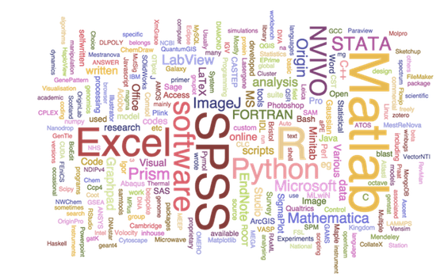
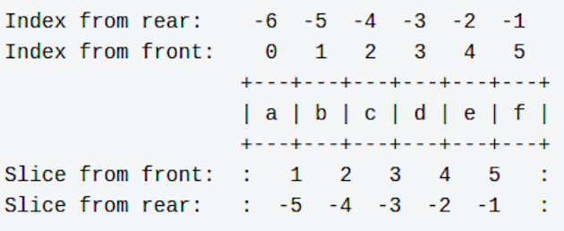
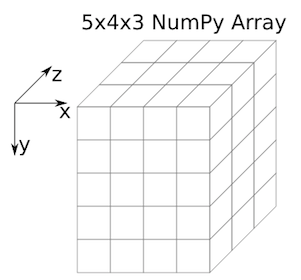
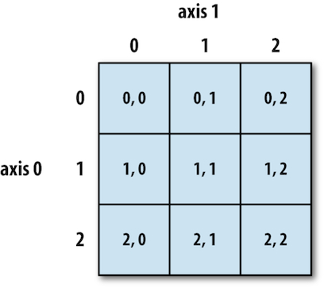

## Why Python?

- It's free, well-documented, and runs almost everywhere
- Large (and growing) user base among researchers and scientists
- Simple, readable, flexible, powerful language and easier for beginners to grasp 
- Goal is to teach basic programming concepts that can be applied to other programming languages

## Why Python?

- Part of the winning formula for productivity, software quality, and maintainability at many institutions and companies across the world
- Largely being used across various application domains:
     + Scientific (Bioinformatics, Biology, Computational chemistry, Data visualisation, Scientific programming etc..)
     + Engineering
     + Software development
     + Arts, business, education and government sectors

## Why Python?

- Used for development on the web and the client 
- Increased productivity:
      + Debugging Python programs is easy: a bad input or bug will show a meaningful error message.
      
## Python is up and coming!

- Based on Southampton PhD students software usage survey conducted by SSI's Policy researchers:
     

## We'll be teaching Python3

- Python is currently transitioning from version 2 to 3
- Teaching will be in 3.4
- Lots of new features of Python3
      + Advanced unpacking
      + Matrix multiplication
      + Chained exceptions
      + Everything is an iterator ...
     
## Learning objectives
 
-  how to assign values to variables and perform simple operations: python basics
-  how to repeat actions with loops 
-  how to correctly evaluate expressions: making choices using conditionals 
-  why we should divide programs into small, single-purpose blocks of code: creating functions
-  how to build a program, step by step, to do basic analysis on some climate data
-  how to read and analyse patient data using libraries
-  how to visualise data using libraries

## Turning on Python Interpreter

- The interpreter provides an interactive environment to play with the language
- Open a terminal window and type **python3.4**     
- If on windows open **Git Bash** (covered in Shell session)
- At the prompt type 'hello world!'
  

## Python Overview

*From Learning Python:*

- Programs are composed of modules
- Modules contain statements
- Statements contain expressions
- Expressions create and process objects

## Basics: Variables, Objects, types and Data Structures

- Introduction to Python variables
- Creating and assigning values to variables
- Everything in Python is really an object
- Types: Built-in types and type handling
     + Built-in: String, integers, boolean and floating point
     + type(val) returns the type of a variable (also classes)  
     + int(val[,base]) converts to an integer (of base base)
     + float(val): Corresponding to floats
     + str(val): Corresponding to strings (classes allow this automatically)

## Python Control Flow

- Real power of programs come from:
      + Repetition
      + Selection
      
## Control Flow: Repeating actions with loops

-  What a loop does?
-  Writing loops to repeat simple calculations
      + Indexing/ Counting starts from **0**
-  Track changes to a loop variable as the loop runs
-  Track changes to other variables as they are updated by a `for` loop      

## Why indentation?

-  Studies show that's what people actually pay attention to
       + Every textbook on C or Java has examples where indentation and bracing don't match
-  Doesn't matter how much indentation you use, but the whole block must be consistent     
-  Python Style Guide (PEP 8) recommends 4 spaces 
-  And no tab characters
      
## Lists in Python

-  Lists as arrays
-  Indexing  
     + Indexing some single value or even a whole set of values from a given list.
     + Indexing for retrieving single elements works as usual in python and indexing by negative numbers starts counting from the end.
-  Slicing
      + Subset of a list, called a **Slice**, by specifying two indices. The return value is a new list containing all the elements of the list, in order, starting with the first slice index, up to but not including the second slice index.
      + **Difference between upper and lower bound is the number of values in the slice.**
      
## Indexing and Slicing a List Example

      
              
   
## Using Python libraries

-  This introduction to Python is built around an end to end scientific example: data analysis
-  What is a library (module) and its usage
-  Reading data from a file
         
## NumPy Arrays

-  NumPy arrays and operations on arrays of data
   
   

## NumPy arrays: Indexing and Slicing

-  Ways of selecting individual values and subsets of data
-  One-dimensional arrays are simple; on the surface they act similarly to Python lists.
 
## Indexing in a NumPy 2D array 

- The indices are (row, column) instead of (column, row).
- Example Patient inflammation data who were given treatment for arthritis:
     + **Rows:** Hold information for a single patient
     + **Columns:**  Represent successive days

## Cont..

    
   
## Data visualisation using libraries

*The purpose of computing is insight, not numbers, Richard Hamming.*

-  Best way to develop insight is often to visualise data.
-  Plotting data using `matplotlib` library

## Control Flow: Making choices

-  Write conditional statements including `if`, `elif` and `else` 
-  A few things to note about the syntax:
      + Each if/ else statement must close with a colon (:)
      + Code to be executed as part of any *if/else* statement must be indented by four spaces.
      + Although not explicitly required, every *if* statement must also include an *else* statement - it just makes for a better program.
-  Evaluate expressions containing `and` and `or`
  
## Creating Functions

-  Defining a function, the parameters that it takes, return value
-  Test and debug a function
-  Scope of variables
-  Set default values for function parameters
-  Divide programs into small, single-purpose functions

## Command-line Programs

-  Using values of command-line arguments in a program
-  Handling flags and files separately in a command-line program
-  Reading data from standard input in a program 

## Wrap-up Challenge: Connecting the dots

**Write a python script (function) for Fahrenheit to Celsius temperature conversion and stores the output in a file.**

- Hint (Tools to be used):
     + Unix pipes and filters
     + Python functions
     + Command-line programs
     + Using Fahr_to_kelvin() and Kelvin_to_celsius() functions

##  Thank You!
